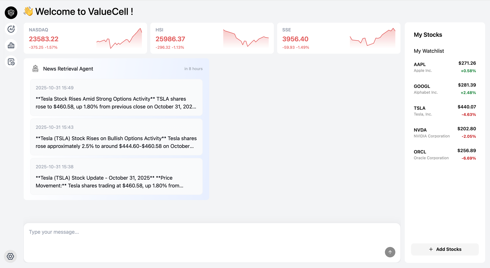
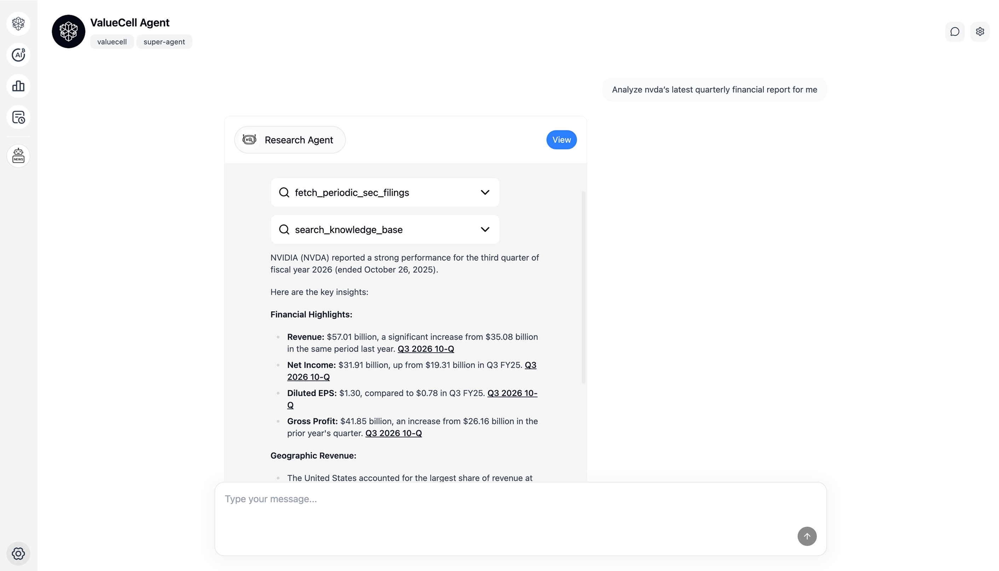
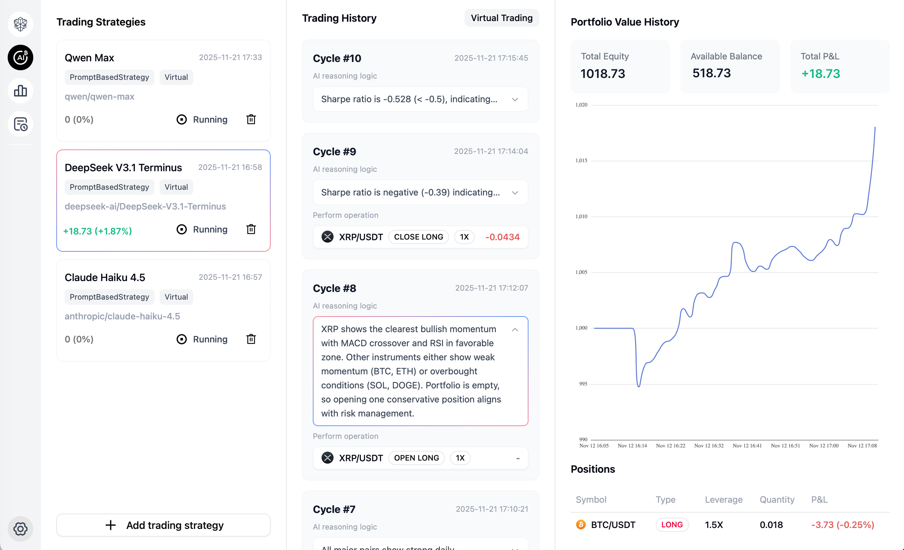
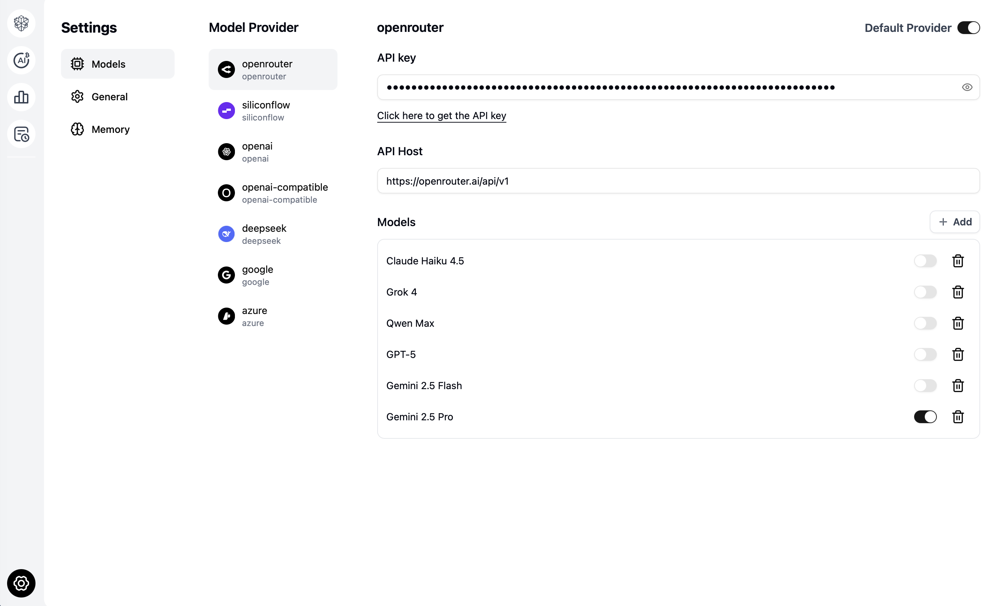
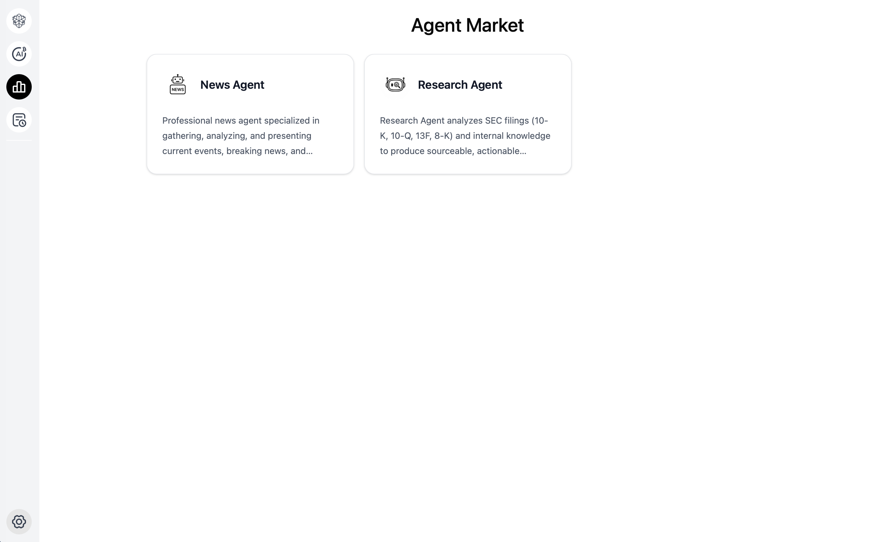

<p align="center">
  
</p>

<div align="center" style="line-height: 2;">
    <a href="https://www.python.org/downloads" target="_blank">
        </a>
    <a href="LICENSE" target="_blank">
        </a>
    <br>
    <a href="https://discord.com/invite/84Kex3GGAh" target="_blank">
        </a>
    <a href="https://twitter.com/intent/follow?screen_name=valuecell" target="_blank">
        </a>
    <a href="https://www.linkedin.com/company/valuecell/" target="_blank">
        </a>
    <a href="https://www.facebook.com/people/ValueCell/61581410516790/" target="_blank">
        </a>
</div>

<div align="center">
  <a href="README.md" style="color: gray;">English</a>
  <a href="README.zh.md" style="color: gray;">中文（简体）</a>
  <a href="README.zh_Hant.md" style="color: gray;">中文（繁體）</a>
  <a href="README.ja.md" style="color: auto;">日本語</a>
</div>


# ValueCell
ValueCellは、金融アプリケーション向けのコミュニティ主導型マルチエージェントプロダクトです。私たちの目標は、世界最大の分散型金融エージェントコミュニティを構築することです。

ポートフォリオ管理を支援するトップクラスの投資エージェントチームを提供します。これにより、銘柄選別、リサーチ、追跡、および取引の完了を支援します。

Discord コミュニティへのご参加をお待ちしています。使用中に発生した問題についてのご意見をお寄せいただき、さらに多くの開発者にご参加いただけますようお願いします🔥🔥🔥

>注意: ValueCellチームメンバーがコミュニティ参加者に主動的に連絡することはありません。このプロジェクトは技術交流のみを目的としています。投資にはリスクが伴います。⚠️

# スクリーンショット

p align="center">
  
</p>

<p align="center">
  
</p>

<p align="center">
  
</p>

<p align="center">
  
</p>

<p align="center">
  
</p>

# 主な機能

<p align="center">
  
</p>


## マルチエージェントシステム
- **DeepResearch Agent**: 株式の基本情報ドキュメントを自動的に取得・分析し、正確なデータインサイトと解釈可能なサマリーを生成
- **Strategy Agent**: 複数の暗号資産とマルチ戦略のスマート取引に対応し、あなたの戦略を自動実行します
- **News Retrieval Agent**: パーソナライズされた定時ニュース配信に対応し、重要情報をタイムリーに追跡します
- **その他**: さらに多くのエージェントを計画中...

## 柔軟な統合
- **複数のLLMプロバイダー**: OpenRouter、SiliconFlow、Azure、Openai-compatible、Google、OpenAIおよびDeepSeekをサポート
- **人気の市場データ**: 米国市場、暗号市場、香港市場、中国市場など
- **マルチエージェントフレームワーク対応**: A2AプロトコルによるLangchain、Agnoをサポート、研究開発の統合を行う
 **マ取引所接続**: OKX と Binance へのリアルタイムルーティングに対応し、安全ガードレールを内蔵

# クイックスタート

ValueCellは包括的なWebインターフェースを備えたPythonベースのアプリケーションです。このガイドに従って、アプリケーションを効率的にセットアップして実行してください。

## 前提条件

最適なパフォーマンスと効率的な開発のために、以下のツールのインストールを推奨します:

**[uv](https://docs.astral.sh/uv/getting-started/installation/)** - Rustで構築された超高速Pythonパッケージおよびプロジェクトマネージャー  
**[bun](https://github.com/oven-sh/bun#install)** - 高性能JavaScript/TypeScriptツールキット(ランタイム、バンドラー、テストランナー、パッケージマネージャーを含む)

## インストール

1. **リポジトリのクローン**

   ```bash
   git clone https://github.com/ValueCell-ai/valuecell.git
   cd valuecell
   ```

2. **環境変数の設定**

   ```bash
   cp .env.example .env
   ```

   APIキーと設定を`.env`ファイルに記入してください。この設定ファイルはすべてのエージェント間で共有されます。設定の詳細については、[設定ガイド](docs/CONFIGURATION_GUIDE.md) をご参照ください。

## 設定

詳細な設定情報については、[CONFIGURATION_GUIDE](./docs/CONFIGURATION_GUIDE.md)を参照してください。

### モデルプロバイダー
`.env`ファイルを編集して、お好みのモデルプロバイダーを設定してください:

- **シンプルセットアップ**: モデルプロバイダーの API キーのみを設定してください

- **高度な設定**: リサーチタイプのエージェントの場合、より多くの環境変数を設定する必要があります。詳細は `.env.example` ファイルを参照してください

- **公式推奨**: OpenRouter + 埋め込みモデルを提供する任意のサプライヤーを設定してください。理由：プロバイダー間のモデルの高速切り替えが可能であり、RAG+Memory AI機能を提供します。


## アプリケーションの実行

完全なアプリケーション(フロントエンド、バックエンド、エージェント)を起動します:

### Linux / Macos
```bash
bash start.sh
```

### Windows (PowerShell)
```powershell
.\start.ps1
```

## インターフェースへのアクセス

- **Web UI**: ブラウザで[http://localhost:1420](http://localhost:1420)にアクセス
- **ログ**: バックエンドサービスと個々のエージェントの詳細な実行時情報については、`logs/{timestamp}/*.log`でアプリケーションログを確認

## 次のステップ

アプリケーションが起動したら、WebインターフェースでValueCellの機能を操作して探索できます。

## リアルタイム取引

- AIモデルの設定: Webインターフェースから AI モデルの API キーを追加します。
- 取引所の設定: Binance/HyperLiquid/OKX/Coinbase... の API 認証情報を設定します。
- ストラテジー作成: AIモデルと取引所を組み合わせてカスタム戦略を作成します。
- モニタリング＆コントロール: 戦略の開始／停止を行い、パフォーマンスをリアルタイムで監視します。

### サポートされている取引所

| 取引所 | 備考 | ステータス |
| --- | --- | --- |
| **Binance** | 国際サイト [binance.com](binance.com) のみサポート（米国サイトは非対応）。USDT-M 先物（USDT証拠金契約）を使用します。先物口座に十分な USDT 残高があることを確認してください。取引ペア形式: `BTC/USDT` | ✅ テスト済み |
| **Hyperliquid** | 証拠金通貨として USDC のみサポートします。メインウォレットアドレス + API ウォレット秘密鍵認証を使用します（[APIタブ](https://app.hyperliquid.xyz/API)から申請）。成行注文は自動的に IoC 指値注文に変換されます。取引ペア形式は手動で `SYMBOL/USDC` に調整する必要があります（例: `WIF/USDC`）。 | ✅ テスト済み |
| **OKX** | 認証には API Key、Secret、Passphrase が必要です。USDT証拠金契約をサポートします。取引ペア形式: `BTC/USDT` | ✅ テスト済み |
| Coinbase | USDT証拠金契約をサポートします。Coinbase International はまだサポートされていません。 | 🟡 部分的にテスト済み |
| Gate.io | USDT証拠金契約をサポートします。API Key と Secret が必要です。 | 🟡 部分的にテスト済み |
| MEXC | USDT証拠金契約をサポートします。API Key と Secret が必要です。 | 🟡 部分的にテスト済み |
| Blockchain | USDT証拠金契約をサポートします。API Key と Secret が必要です。 | 🟡 部分的にテスト済み |

**凡例**:
- ✅ **テスト済み**: 本番環境で完全にテストおよび検証済み
- 🟡 **部分的にテスト済み**: コードの実装は完了していますが、完全にはテストされておらず、デバッグが必要な場合があります
- **推奨**: 完全にテストされた取引所（Binance, Hyperliquid, OKX）を優先的に使用してください

### 注意事項
- 現在はレバレッジ取引のみをサポートしているため、Perps（無期限先物）アカウントに十分な残高があることを確認する必要があります。
- 資金の損失を防ぐため、API シークレットは安全に保管する必要があります。アプリはシークレットをデバイス上にローカルに保存し、インターネット経由で第三者に送信することはありません。
- アカウントの安全を確保するために、API キーを定期的にリセットする必要があります。

---
**注意**: アプリケーションを実行する前に、すべての前提条件がインストールされ、環境変数が適切に設定されていることを確認してください。
長期間更新がない場合は、プロジェクト内のデータベースファイル(`lancedb/`、`valuecell.db`、`.knowledgebase/`)を削除してから再起動できます。


# 開発者

すべての開発者をDiscordディスカッショングループに招待し、コミュニティのRoadMapと将来のコミュニティコントリビューター権利計画について定期的に交流します

開発プロセスと標準の詳細については、[CONTRIBUTING.md](.github/CONTRIBUTING.md)を参照してください

# ロードマップ

## 🤖 強化されたエージェント機能
### 取引能力
- **暗号通貨**: OKX、BinanceとHyperliquid の取引所に対応、今後さらに多くの取引所を順次追加予定です…
- **証券**: AI証券取引を段階的にサポート

### 市場拡大
- **ヨーロッパ市場**: FTSE、DAX、CAC 40などのヨーロッパ取引所のサポートを追加
- **アジア市場**: 日経、新興アジア市場へのカバレッジ拡大
- **商品市場**: 石油、金、銀、農産物の分析
- **外国為替市場**: 主要通貨ペアとクロスカレンシー分析

### 資産の多様化
- **債券**: 国債、社債、利回り分析エージェント
- **デリバティブ**: オプション、先物、複雑な金融商品
- **オルタナティブ投資**: プライベートエクイティ、ヘッジファンド、ベンチャーキャピタル分析

### 高度な通知とプッシュタイプ
- **リアルタイムアラート**: 価格変動、出来高急増、テクニカルブレイクアウト
- **スケジュールレポート**: 日次/週次/月次ポートフォリオサマリー
- **イベント駆動型通知**: 決算発表、配当発表、規制変更
- **カスタムトリガー**: ユーザー定義の条件としきい値
- **マルチチャネル配信**: Discord と Webhook 統合

## ⚙️ 製品設定とパーソナライゼーション
### マルチプラットフォーム製品
- **デスクトップサポート**: デスクトップとクライアント機能を段階的にサポート
- **データベースホットアップデート**: 互換性アップグレードの段階的サポート

### 国際化(i18n)
- **多言語サポート**: 英語、中国語(簡体字/繁体字)、日本語、韓国語、スペイン語、フランス語
- **ローカライズされた市場データ**: 地域固有の金融用語とフォーマット
- **文化的適応**: タイムゾーン、日付フォーマット、通貨設定
- **エージェントのパーソナリティのローカライゼーション**: 文化的に適切なコミュニケーションスタイル

### トークンと認証管理
- **APIキー管理**: サードパーティAPIキーの安全な保存とローテーション
- **OAuth統合**: 主要な金融データプロバイダーのサポート

### ユーザー設定とカスタマイズ
- **投資プロファイル**: リスク許容度、投資期間、戦略の好み
- **UI/UXカスタマイズ**: ダーク/ライトモード、ダッシュボードレイアウト、ウィジェット設定
- **エージェントの動作**: コミュニケーション頻度、分析深度、レポートスタイル
- **ポートフォリオ管理**: カスタムベンチマーク、パフォーマンス指標、配分目標

### メモリと学習システム
- **会話履歴**: セッション間での永続的なチャット履歴
- **ユーザー学習**: ユーザー行動に基づく適応的な推奨
- **市場メモリ**: 履歴コンテキストとパターン認識
- **設定の進化**: 時間経過に伴う推奨の動的調整

## 🔧 ValueCell SDK開発
### コアSDK機能
- **Python SDK**: エージェント統合とカスタマイズのための包括的なライブラリ
- **WebSocketサポート**: リアルタイムデータストリーミングと双方向通信

### エージェント統合フレームワーク
- **プラグインアーキテクチャ**: サードパーティエージェントとツールの簡単な統合
- **エージェントレジストリ**: コミュニティ貢献エージェントのマーケットプレイス

### 開発者ツールとドキュメント
- **インタラクティブAPIエクスプローラー**: ライブテスト機能付きSwagger/OpenAPIドキュメント
- **コード例**: 複数のプログラミング言語でのサンプル実装
- **テストフレームワーク**: ユニットテスト、統合テスト、モックデータプロバイダー


# Star History

<div align="center">
<a href="https://www.star-history.com/#ValueCell-ai/valuecell&Date">
 <picture>
   <source media="(prefers-color-scheme: dark)" srcset="https://api.star-history.com/svg?repos=ValueCell-ai/valuecell&type=Date&theme=dark" />
   <source media="(prefers-color-scheme: light)" srcset="https://api.star-history.com/svg?repos=ValueCell-ai/valuecell&type=Date" />
   
 </picture>
</a>
</div>

<div align="center">
